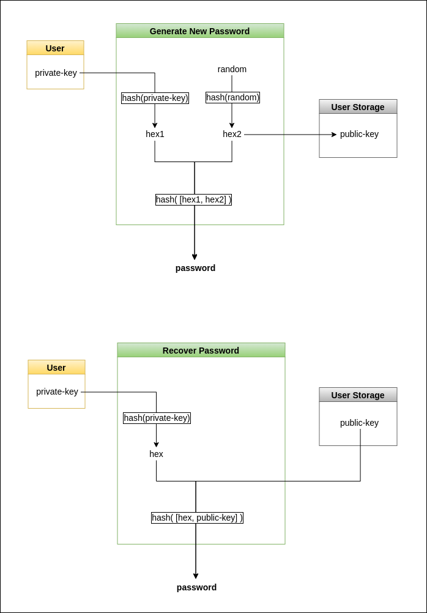

# keys-to-password

</br>

#### Generate and recover passwords via private and public keys (up to 40 characters in the generated password).

[](https://www.npmjs.com/package/keys-to-password)

## Installation

node:

```js
npm install keys-to-password
```

## import

```js
import Password from "keys-to-password";
```

</br></br>

## Default usage

```js
const password = new Password("your-private-key");
password.setKeyboard(); // Password can contain all keyboard characters
password.generate(); // Password-length = 12
password.getPassword(); // => '?gj39?GdA_gkf'
```
</br>

## Workflow



</br>

## A general example


### 1) Generate password

```js
const password = new Password("your-private-key");
password.setKeyboard();
password.generate({ passLength: 15 });
password.getPassword(); // => 'y$$&TTU+-&ZZ1-0'
```

### 2) Get password public-key from the generated password

```js
const publicKey = password.getPublicKey();
```

### 3) Recover password by private and public keys

```js
const passwordRecover = new Password("your-private-key", publicKey);
passwordRecover.setKeyboard();
passwordRecover.generate({ passLength: 15 });
```

### 4) Retrieving the password

```js
passwordRecover.getPassword(); // => 'y$$&TTU+-&ZZ1-0'
```

</br>

## Modify password using arguments

### 1) Modify keyboard
```js
const password = new Password('your-private-key');
const keyboardConfig = {
    avoidChars = "1a$",  // Characters 1,a,$ will not be in the generated password
    isContainDigits = true,
    isContainUpperCase = false, // Uppercase letters will not be in the generated password
    isContainLowerCase = true,
    isContainSymbols = true,
    mustContainChars = "d3", // Characters d,3 will be in the generated password (not yet implemented)
}

password.setKeyboard(keyboardConfig);
```

### 2) Extra generation options
```js
const generateConfig = {
  passLength = 20,
  passStartsWith = "abc", // Generated password will start with the string 'abc'
  passEndsWidth = "xyz" // Generated password will end with the string 'abc'
}

password.generate(generateConfig);
```

### 3) Retrieving the password

```js
password.generate(generateConfig);
```

</br>

## Modify password using pattern function

```js
const password = new Password("your-private-key");
password.generateFromPattern("A\\d{10}-PASS");
password.getPassword(); // => 'A2563495820-PASS'
```

### Pattern syntax options:

- All keyboard characters.
- \\d{n}  =>  assign n digits.
- \\u{n}  =>  assign n uppercase letters.
- \\l{n}  =>  assign n lowercase letters.
- \\s{n}  =>  assign n symbol characters.

</br></br>
___
### Note:

- 'mustContainChars' argument in the keyboard config not yet implemented.
